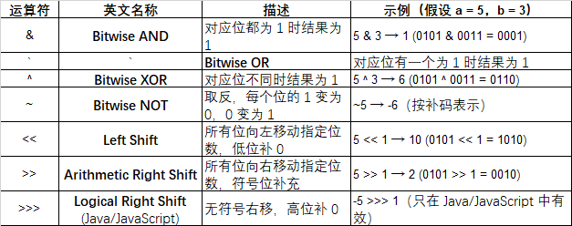
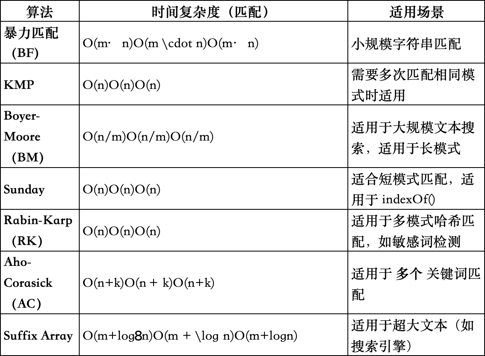

# Rules & Thoughts

## Conventional Git Commit Msg Example

- *feat* 新功能（feature） 增加新的功能或特性
- *fix* 修复 bug	修复问题或 bug
- *docs* 文档变更 re只修改了文档
- *style* 代码格式（不影响功能，如空格、格式化等）不改变代码含义的改动
- *refactor* 代码重构（即不是新增功能，也不是修 bug）代码结构的调整，功能不变
- *perf* 性能优化 提升性能的修改
- *test* 添加或修改测试代码 修改测试文件
- *chore* 杂务（构建过程、辅助工具的变动）非代码逻辑修改，例如构建系统或工具依赖
- *build* 构建相关的修改（例如 npm 包）影响构建系统的变更
- *ci* CI 配置文件的修改 与持续集成（CI）相关的更改
- *revert* 回滚上一次提交 撤销某次提交

## Bitwise Operators



## Backtracking algorithm

- 回溯算法（Backtracking）是一种基于递归的暴力搜索方法
- 主要用于解决组合、排列、子集等问题。
- 它的核心思想是构造解的过程，通过递归尝试所有可能的选择
- 在遇到不符合条件的情况时回溯，撤销当前选择，尝试其他可能的路径。

📌 回溯算法的基本思想
- 回溯算法遵循**试探 - 撤回（回溯）**的思想，即：

1. 选择一个可能的解（Make a Choice）
2. 递归进入下一步（Explore）
3. 如果遇到不符合要求的情况，撤销选择（Backtrack），回到上一步重新选择

```
void backtrack(参数) {
    if (终止条件满足) {
        记录解；
        return;
    }
    for (选择 in 可选项集合) {
        做出选择;
        backtrack(下一步);
        撤销选择（回溯）;
    }
}
```

📌 回溯的应用场景
- 回溯算法主要用于搜索所有可能的解，适用于以下问题：

1. 组合问题（如求所有子集、组合总和）
2. 排列问题（如全排列）
3. 图搜索问题（如N皇后、数独求解）
4. 字符串处理（如正则匹配、括号生成）

📌 回溯的时间复杂度分析
- 回溯算法的时间复杂度通常是指数级 O(2^n) 或 O(n!)，
- 因为它尝试所有可能的组合或排列。

✅ 回溯算法本质是 深度优先搜索（DFS）的一种变体，适用于搜索所有可能的解。

## Pruning 

📌 剪枝的作用

- 在回溯算法中，剪枝（Pruning）指的是在构造解的过程中提前跳过不可能产生有效解的分支，从而减少搜索空间。
- 具体来说，当递归搜索过程中出现某些情况，使得继续深入已无意义时，我们就可以“剪去”当前分支，不再往下探寻。
- 这样做可以避免大量无效的计算，提高算法效率。通常在回溯搜索时，遇到以下情况可以立即结束当前分支的探索：
- 违反约束条件：部分解已经不满足问题的约束条件。例如，在N皇后问题中，如果新放置的皇后与已有皇后冲突，那么这个部分解不可能扩展为完整解，需要立即剪枝。
- 无法达到目标：部分解虽暂时合法，但已不可能得到符合要求的完整解。例如，在组合求和问题中，如果当前累计和已经超过目标值，那么再继续添加数字只会使和更大，无法得到正好等于目标的解，这种分支应立即停止。
- 通过剪枝，我们及时排除掉这些“不可能成功”的路径，避免了对后续所有子树的无谓搜索。剪枝不会影响结果的正确性，但能显著减少需要搜索的节点数量。尽管回溯算法的最坏时间复杂度仍是指数级，但合理的剪枝在实际求解中可以大幅提升效率。

✅ 通过剪枝，可以有效跳过不可能得到解的分支，显著减少无效搜索，大幅提升回溯算法的运行效率。

## Robber House Problem

- 打家劫舍问题（House Robber Problem）是一个经典的 动态规划（Dynamic Programming, DP） 问题
- 主要涉及最优选择的动态规划策略。

🚀 问题描述
- 你是一个小偷，计划偷窃一排房屋。每个房屋都有一定的现金 nums[i]，但：

- 如果你偷了相邻的两个房屋，你会被发现。
- 你的目标是偷到最多的钱，但不能偷连续的房屋。

📌 状态转移方程
- 定义 dp[i] 为前 i 个房屋能偷到的最大金额：

`
如果不偷 i 号房间，最大金额是 dp[i-1]。
如果偷 i 号房间，最大金额是 dp[i-2] + nums[i]（必须跳过 i-1）。
状态转移方程：
lua
複製
編輯
dp[i] = max(dp[i-1], dp[i-2] + nums[i])
`

- 代码实现
```
  class Solution {
  public int rob(int[] nums) {
  if (nums.length == 0) return 0;
  if (nums.length == 1) return nums[0];

        int[] dp = new int[nums.length];
        dp[0] = nums[0]; 
        dp[1] = Math.max(nums[0], nums[1]);

        for (int i = 2; i < nums.length; i++) {
            dp[i] = Math.max(dp[i - 1], dp[i - 2] + nums[i]);
        }

        return dp[nums.length - 1];
  }
  }
```

## Manacher 算法的核心思想

1. 预处理字符串：

- 在原始字符串的每个字符之间插入一个特殊字符（例如 #），将字符串统一为奇数长度。

- 例如，字符串 "abba" 会被预处理为 "#a#b#b#a#"。

2. 利用回文串的对称性：

- 维护一个数组 p[]，其中 p[i] 表示以位置 i 为中心的最长回文半径。

- 维护两个变量：

- center：当前已知的最右回文串的中心位置。

- maxRight：当前已知的最右回文串的右边界。

3. 动态扩展回文半径：

- 对于每个位置 i，利用对称性快速初始化 p[i]，然后尝试扩展回文半径。

- 如果 i 在 maxRight 的范围内，则可以利用对称位置 mirror_i 的值来初始化 p[i]。

4. 更新最右回文串：

- 如果以 i 为中心的回文串的右边界超过了 maxRight，则更新 center 和 maxRight。

## KMP（Knuth-Morris-Pratt）字符串匹配算法

- KMP 算法（Knuth-Morris-Pratt Algorithm）是一种高效的字符串匹配算法，用于在主串 S 中查找模式串 P 的所有匹配位置利用模式串自身的重复结构来避免不必要的匹配回溯，从而降低匹配过程的时间复杂度 。

🔹 KMP 的优化点：

在匹配过程中，KMP 通过模式串 P 预处理出 next 数组，用于决定当某个字符匹配失败时，P 应该跳转到哪个位置继续匹配，避免重复比较 。
**最坏时间复杂度降至 `*，比暴力匹配法快很多 。

```
void KMP(String S, String P) {
    int n = S.length(), m = P.length();
    int[] next = new int[m];
    buildNext(P, next);

    int j = 0; // P 的索引
    for (int i = 0; i < n; i++) { // 遍历 S
        while (j > 0 && S.charAt(i) != P.charAt(j)) {
            j = next[j - 1]; // 发生失配，跳转
        }
        if (S.charAt(i) == P.charAt(j)) {
            j++; // 继续匹配下一个字符
        }
        if (j == m) { // 找到 P 的完整匹配
            System.out.println("匹配起始位置: " + (i - m + 1));
            j = next[j - 1]; // 继续查找下一个匹配
        }
    }
}

def buildNext(patt):
"""
计算next数组
"""
    next = [0]
    prefix_len = 0
    i = 1
    while i < len(patt):
        if patt[prefix_len] = patt[i]
            prefix_len += 1
            next.append(prefix_len)
            i+= 1
        else:
            if patt_len == 0
                next.append[0]
                i += 1
            else:
                prefix_len = next[prefix_len - 1]
    return next
```



