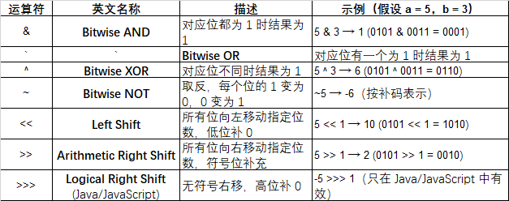

# Rules & Thoughts

## Conventional Git Commit Msg Example

- *feat* 新功能（feature） 增加新的功能或特性
- *fix* 修复 bug	修复问题或 bug
- *docs* 文档变更 re只修改了文档
- *style* 代码格式（不影响功能，如空格、格式化等）不改变代码含义的改动
- *refactor* 代码重构（即不是新增功能，也不是修 bug）代码结构的调整，功能不变
- *perf* 性能优化 提升性能的修改
- *test* 添加或修改测试代码 修改测试文件
- *chore* 杂务（构建过程、辅助工具的变动）非代码逻辑修改，例如构建系统或工具依赖
- *build* 构建相关的修改（例如 npm 包）影响构建系统的变更
- *ci* CI 配置文件的修改 与持续集成（CI）相关的更改
- *revert* 回滚上一次提交 撤销某次提交

## Bitwise Operators

